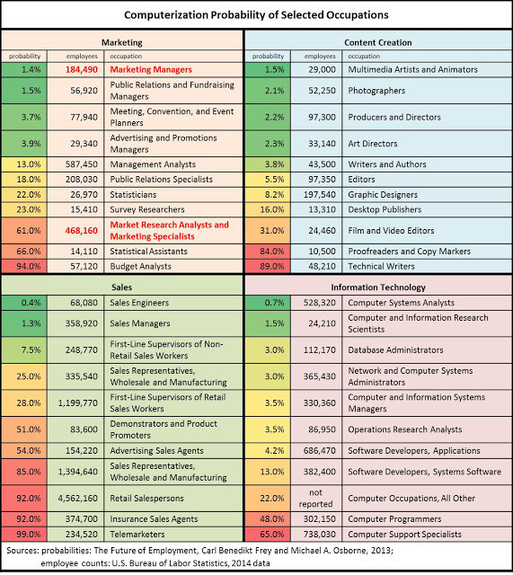
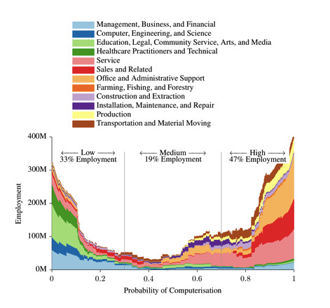

700+ occupations studied for automation potential.

Interesting points from the ["THE FUTURE OF EMPLOYMENT: HOW SUSCEPTIBLE ARE JOBS TO COMPUTERISATION?"](http://www.oxfordmartin.ox.ac.uk/downloads/academic/The_Future_of_Employment.pdf) by Carl Benedikt Frey and Michael A. Osborne:

## 2 waves of automation

- "In the first wave, we find that most workers in transportation and logistics occupations, together with the bulk of office and administrative support workers, and labour in production occupations, are likely to be substituted by computer capital."
- "More surprising, at first sight, is that a substantial share of employment in services, sales and construction occupations exhibit high probabilities of computerisation."

In other news. [Google is trying to offload its robotics division](http://www.bloomberg.com/news/articles/2016-03-17/google-is-said-to-put-boston-dynamics-robotics-unit-up-for-sale). That was quick - it was acquired just 3 years ago.

Originally published on [LinkedIn](https://www.linkedin.com/pulse/47-total-us-employment-high-risk-category-automation-alex-lyashok).

