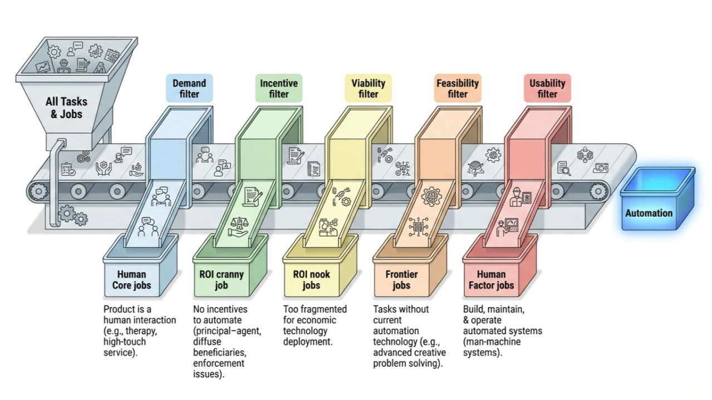

Any tech must pass a [number of filters](https://www.svpg.com/four-big-risks/) to work in practice.

- Demand - no strong preference agains it
- Incentives - someone must want to pay for it
- Viability - it needs to have viable business case
- Feasibility - it must actually work
- Usability - someone needs to build and run it

In the context of "AGI automating all jobs" this creates 5 job categories:

1. Human Core jobs: jobs that never get automated because the product is a human interaction.
2. ROI cranny job: jobs which do not have incentives to be automated (principal–agent problems, diffuse beneficiaries, weak enforcement, procurement politics, etc).
3. ROI nook jobs: jobs that are so fragmented that technology cannot be economically deployed to address them.
4. Frontier jobs: jobs that have tasks that do not yet have technology to automate them. Like OCR that works :)
5. Human Factor jobs: jobs to build, maintain, and operate automated systems since all automations are man-machine systems.

## How strong are these filters?

Counter to popular belief - they are all quite strong. It is not "lack of AGI" that drives human employment:

- [20% of jobs are human at the core](https://www.linkedin.com/pulse/automation-every-5th-job-forever-human-alex-lyashok-rvrte)
- 30% of jobs lack incentives to be automated (write-up incoming)
- [25% of jobs are too unique](https://www.linkedin.com/pulse/limits-automation-20-jobs-roi-nooks-alex-lyashok-revoe) to be automated with ANY technology
- 15% of jobs are too complex for the tech at the time (write-up incoming)
- [10% of jobs are in build/run](https://www.linkedin.com/pulse/automation-full-fallacy-alex-lyashok-lraee) of already deployed systems

Balance between these categories changes from decade to decade, from developed to emerging economies, etc.

However, none of these categories can or will go to 0% - not in theory and not in practice.

Originally published on [LinkedIn](https://www.linkedin.com/pulse/5-great-filters-automation-why-jobs-exist-forever-alex-lyashok-st9ge).

