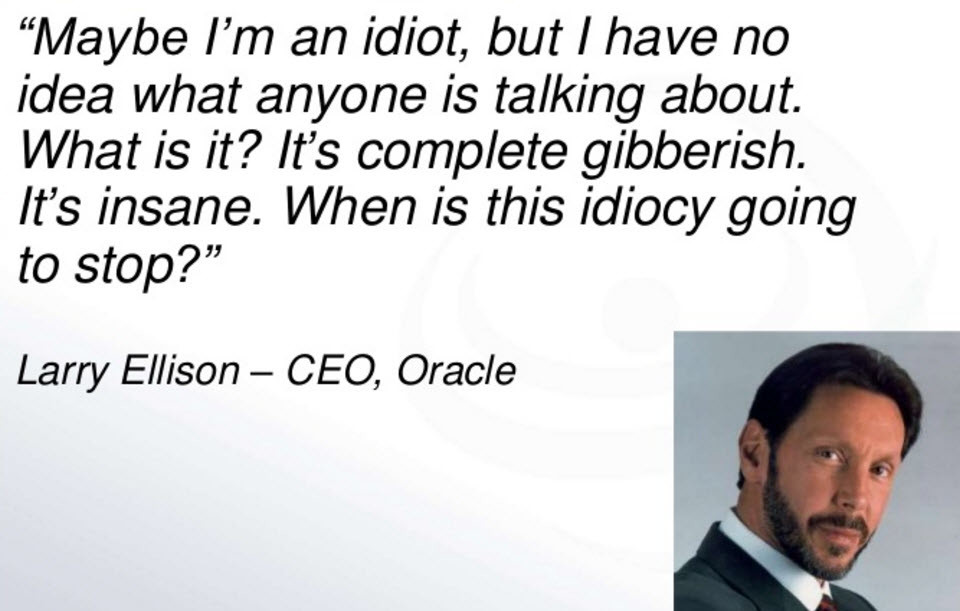
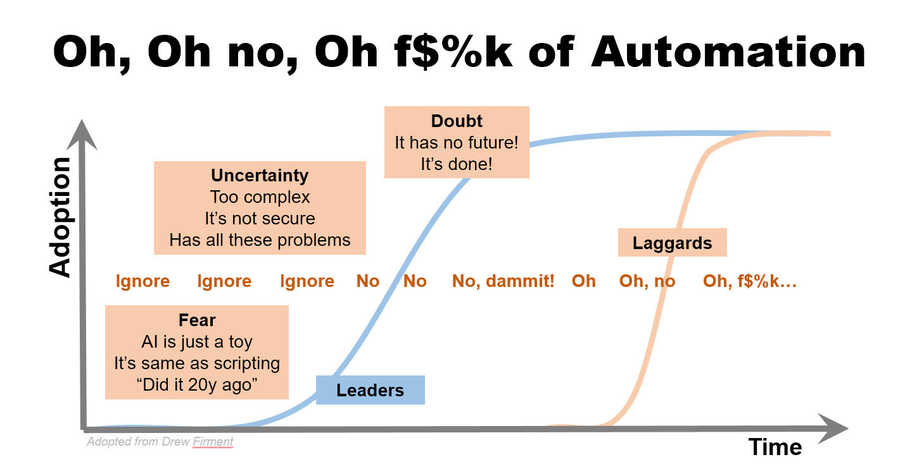

Remember [Larry Ellison and Cloud](http://www.youtube.com/watch?v=0FacYAI6DY0)?

Well, we passed the Oh, f$%k moment for Oracle some time ago when it launched its version of Cloud offerings.

Every technology goes through the adoption cycle. Yet, incentives to not change are so strong that history plays out the same way for Cloud, Mobile, IoT and many other technologies?

What about automation?

Well it is going through exactly the same.

Follow me on [@alyahsok](http://twitter.com/alyashok)

Originally published on [LinkedIn](https://www.linkedin.com/pulse/oh-fk-automation-alex-lyashok).

