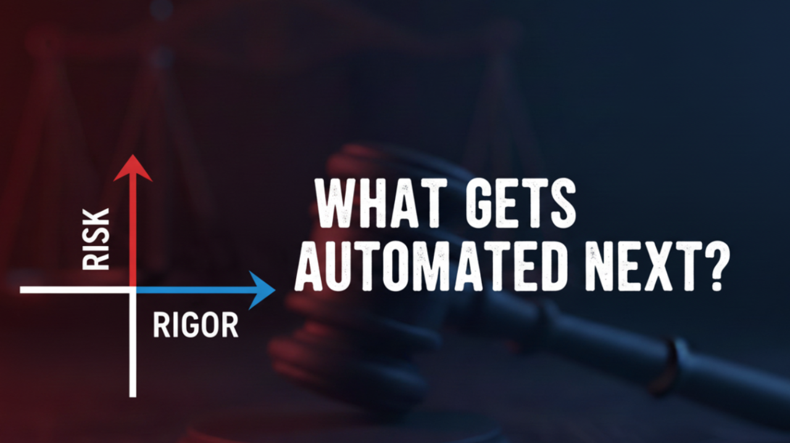
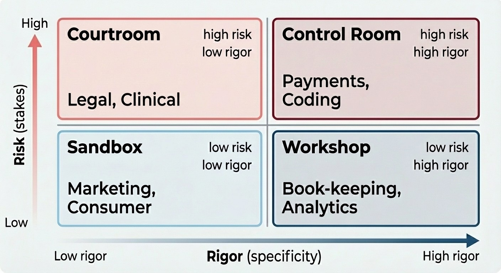
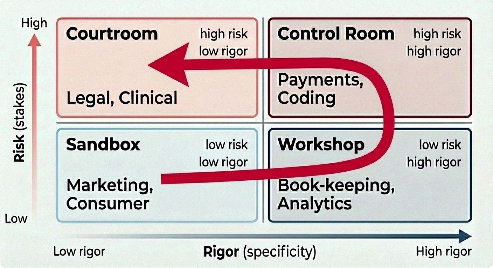
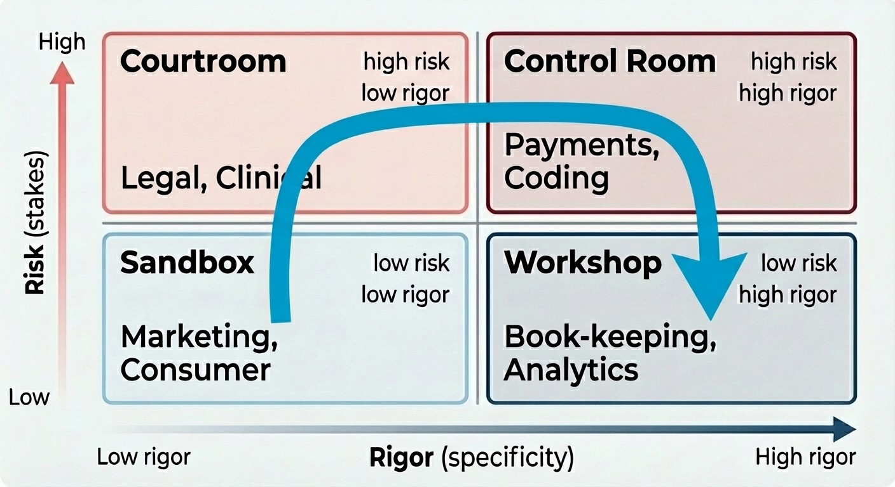

What gets automated next never ceases to surprise people. "AI is generating art but document OCR is not a solved". "AI wins math olympiads but cannot merge two tabs in a spreadsheet".

Mistakes that account for a lot of the failed automation bets - failed startup investments, misguided roadmaps, botched software implementations - boil down to people ignoring that:

Partial automation comes before full automation.

This seems obvious. However, there are important non-obvious implications:

1. Partial work product is hard to resume. "90% done = 90% to go" is the expression. Most work artifacts do not have a built-in way to track what was done. Redline/change tracking in documents works ok. Diffs/reviews in spreadsheets are a nightmare.
2. Partial work product is hard to evaluate. It's hard enough to assign value to finished work: slides, marketing copy, contracts. Evaluating pre-work is doubly hard.

Again, these seem obvious. People have dealt with inability to resume for millennia: checklists, stamps, double-entry systems, witnessing, etc. People have also evolved "domain-specific languages" for tasks where judging [pre-]work is a must: math, chemistry, coding, etc.

Despite all this, if you have ever sat in a pitch for automation, you have heard this:

- Customer: "Our process is currently 100% accurate. How is your software?"
- Vendor: "We use FluxCapacitor4.1 [insert-other-fancy-tech-name-here] and it is 99% accurate."
- Customer: "99% sounds very close to 100%. How will we fix the remaining 1%?"
- Vendor: "This is what Phase 2 is for."

"Phase 2" takes 18 months and wipes out all the benefits of Phase 1.

This is because building human-in-the-loop interfaces is hard and expensive.

## Risk-Rigor framework

One way to reason about automation order is to place pre-automation process on a 2x2 matrix:

- Risk: low-stakes vs high-stakes process. High-stakes manual processes have review/check/approve processes. Truly high-stakes processes have irreversible outcomes and so have multiple layers of human review (anti-money laundering, 6-eyes payment approvals, second opinions).
- Rigor: low-specificity vs high-specificity process. High-specificity processes make use of domain-specific languages (DSL). Jargon is not DSL. "Legalese" is not DSL. True DSLs are code or near-code languages, are very hard to learn and so exist only in tasks that really cannot be specified differently.

## Naive automation order

Naive prediction goes like this:

I think the reason that people think this way is mostly because we are trained to think that people who work in "Courtroom" professions tend to study longer or "make more money" and so things they do manually are harder to automate.

### Actual automation order

Partial automation comes before full automation, so:

- Sandbox first. Low-rigor + low-risk work goes first. This is not controversial. Partial or event poor quality results are acceptable. Cue in bots, AI slop, vibe-coded apps, etc.
- Courtroom before Control Room. Low-rigor + high-risk goes before high-rigor work. This is counter-intuitive but true because a) by definition, there is a well-performing human review process for partial results b) partial results can be presented as [nearly-]full since there is no formal verification process. eDiscovery, medical imaging, KYC, cybersec, recruiting - so many examples here.
- Control Room before Workshop. High-risk + high-rigor work gets automated before low-risk. Existing review process + formal verification make automation easy. This is why coding automation is on fire: PR review + unit testing grease the wheels.

The fact that "Workshop" gets automated last is not common wisdom. Talk to your accountant.

## Caveats

- Quadrants are not to scale.
- Not all work can be automated using current generation of tech.
- Not all work needs to be automated.

## Final thoughts

End users are not “casual,” “novice,” or “naive” users; they are people such as chemists, librarians, teachers, architects, and accountants, who have computational needs and want to make serious use of computers, but who are not interested in becoming professional programmers.

From an oldie-but-a-goodie book on this topic:

A Small Matter of Programming: Perspectives on End User Computing by [Bonnie A. Nardi](https://mitpress.mit.edu/author/bonnie-a-nardi-16879) [https://mitpress.mit.edu/9780262140539/a-small-matter-of-programming/](https://mitpress.mit.edu/9780262140539/a-small-matter-of-programming/)

Like and subscribe to hear more on automation.

Originally published on [LinkedIn](https://www.linkedin.com/pulse/predicting-automation-risk-rigor-framework-alex-lyashok-gyzwe).

