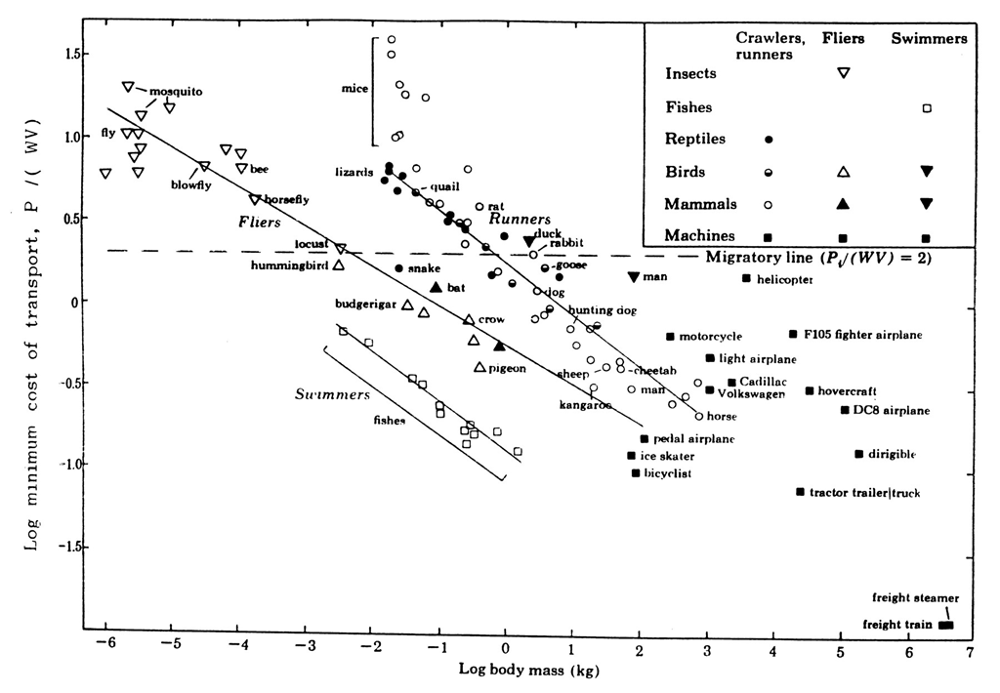

Steve Jobs' "bicycle for the mind" line works because it is not about replacing the rider. It is about turning human effort into leverage.

In the 1990 Library of Congress film ["Memory & Imagination"](https://allaboutstevejobs.com/videos/misc/library_of_congress_1990), Jobs described the computer as:

> "...the equivalent of a bicycle for our minds."

He was referring to a Scientific American comparison of locomotion efficiency. A human walking is not exceptional. A human on a bicycle moves to the edge of the chart.

The chart traces back to S. S. Wilson's article ["Bicycle Technology"](https://www.scientificamerican.com/author/s-s-wilson/), published in Scientific American in March 1973. The article's DOI is [10.1038/scientificamerican0373-81](https://doi.org/10.1038/scientificamerican0373-81).

Scientific American later revisited the same idea in ["A Human on a Bicycle Is among the Most Efficient Forms of Travel"](https://www.scientificamerican.com/article/a-human-on-a-bicycle-is-among-the-most-efficient-forms-of-travel-in-the/), which makes the origin of the Jobs metaphor easier to see: the bicycle does not remove the human from the system. It changes what the human can do.

That is still the right bar for computing and AI tools. The best version is not magic. It is leverage that keeps the rider in the loop.
