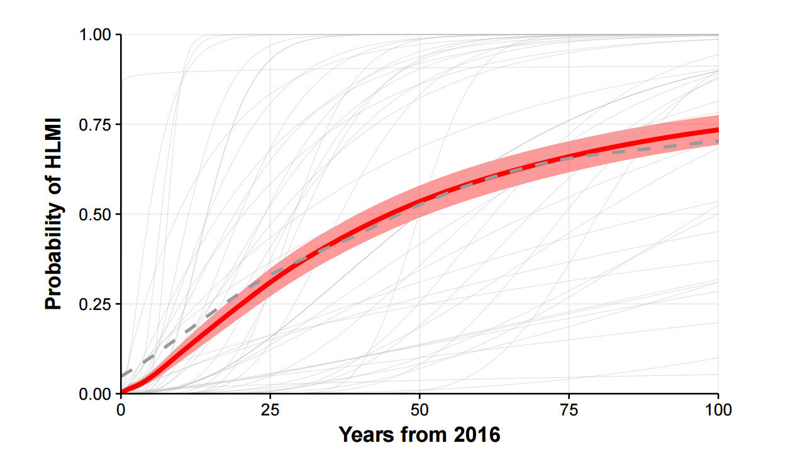
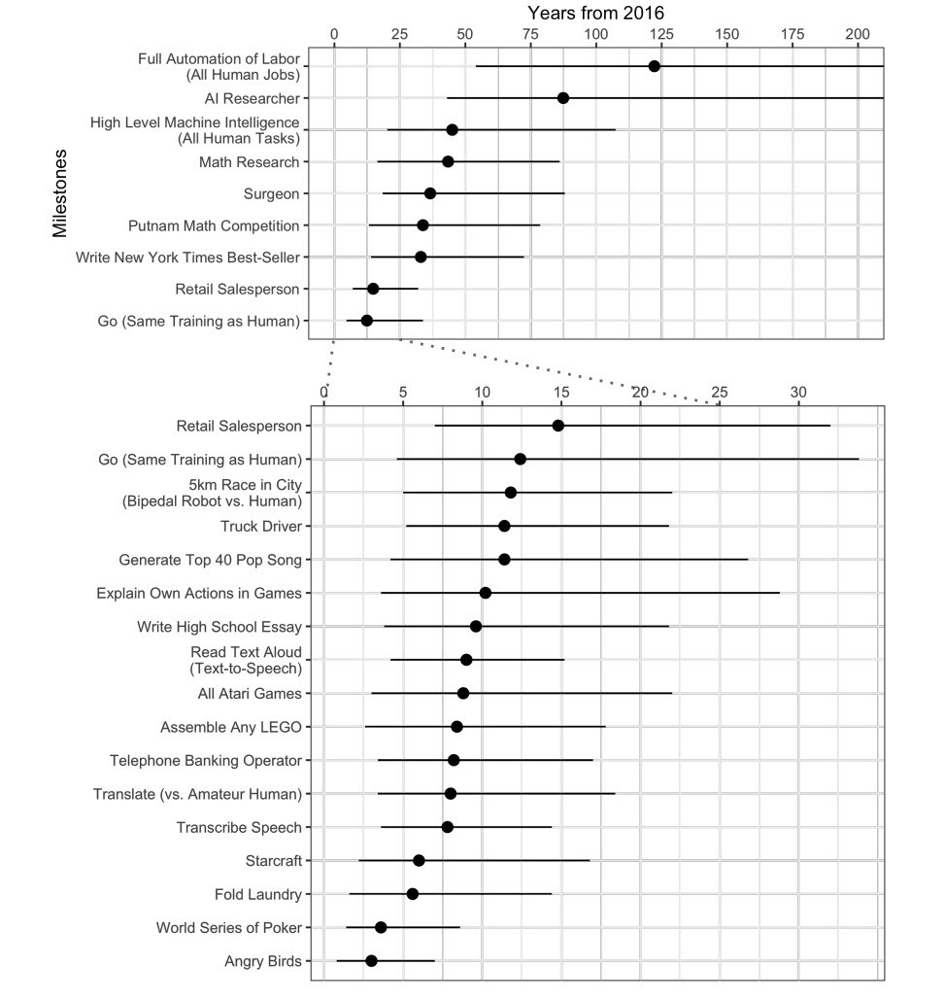

Interesting [paper](https://arxiv.org/pdf/1705.08807.pdf) was published May 30th 2017.

In this paper 352 researchers answered the question of when will High Level Machine Intelligence (HLMI) will come to life. Below was the definition:

    “High-level machine intelligence” (HLMI) is achieved when unaided machines can accomplish every task better and more cheaply than human workers.

Here is an aggregate result:

Basically, average opinion is that:

- All jobs will be automated within 125 years (sounds like a long time!)
- All human tasks will be automated within 50 years (let's hope!)

It is also interesting that there is bias by the region. Asian experts are much more aggressive on forecasts, on average predicting HLMI to appear 44 years earlier. More details on the pic below.

There is also an interactive site live now: [https://willrobotstakemyjob.com](https://willrobotstakemyjob.com)

June IEEE issue also has an interesting roundup of [expert predictions](http://spectrum.ieee.org/computing/software/humanlevel-ai-is-right-around-the-corner-or-hundreds-of-years-away). Brain-like AI is either right around the corner - 2029 according to Google's own Ray Kurtzweil - or 100s of years away.

Sum total: it's anyone's guess.

Originally published on [LinkedIn](https://www.linkedin.com/pulse/when-all-jobs-automated-alex-lyashok).

